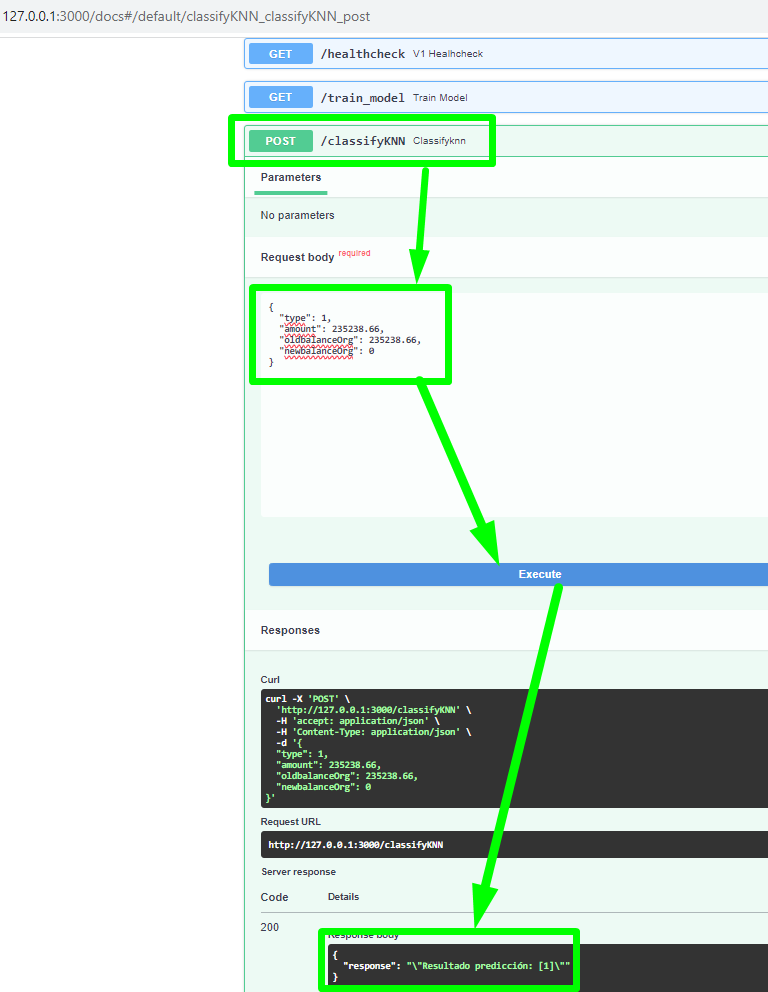

___
### ITESM Instituto Tecnológico de Estudios Superiores de Monterrey
### Course:     MLOps Machine Learning Operations
#### Teacher:   Carlos Mejia
#### Student:   Francisco Javier Torres Zenón  A01688757
____

## Introduction of the project

Welcome to the final project focused on MLOps, where the key concepts of ML frameworks and their application will be applied in a practical approach. Throughout this project, the basic concepts and fundamental tools for developing software in the field of MLOps are shown, covering everything from configuring the environment to best practices for creating ML models and deploying them.

## About the project

The overall goal of this project is to build a robust and reproducible MLOps workflow for developing, training, and deploying machine learning models. A linear regression model will be used as a proof of concept due to its simplicity, and it will be applied to the Titanic data set to predict the probability of survival of a passenger based on certain characteristics.

This project covers the following topics:

1. **Key concepts of ML systems**  
The objective of this module is to give an introduction to MLOps, life cycle and architecture examples is also given.

2. **Basic concepts and tools for software development**  
This module focuses on introducing the principles of software development that will be used in MLOps. Consider the configuration of the environment, tools to use, and best practices, among other things.

3. **Development of ML models**  
This module consists of showing the development of an ML model from experimentation in notebooks, and subsequent code refactoring, to the generation of an API to serve the model.

4. **Deployment of ML models**  
The objective of this module is to show how a model is served as a web service to make predictions.

5. **Integration of concepts**  
This module integrates all the knowledge learned in the previous modules. A demo of Continuous Delivery is implemented.


## References
* Dataset and baseline notebook copied from [Online Payments Fraud Detection Dataset | Kaggle](https://www.kaggle.com/datasets/rupakroy/online-payments-fraud-detection-dataset) 
* Dataset: https://www.kaggle.com/datasets/rupakroy/online-payments-fraud-detection-dataset/download?datasetVersionNumber=1
* Baseline notebook: https://www.kaggle.com/code/nehahatti/online-payments-fraud-detection-project/notebook

### Baseline

This notebook was taken and changed from [Kaggle](http://www.kaggle.com)

1. The task is to predict online payment fraud, given a number of features from online transfer/deposits transactions.

2. On Kaggle there were several notebooks related to this dataset(Decision Tree, Logistic Regresion, KNN, Gradient Boosting Classifier)
3. As a Baseline I choose one of the most accurated and simpler one, a notebook using the Decision Tree algorithm.

**Baseline Metrics**
```
Confussion Matrix
[[1270721     149]
 [     86    1568]]
```

```
 Classification Report
              precision    recall  f1-score   support

           0       1.00      1.00      1.00   1270870
           1       0.91      0.95      0.93      1654

    accuracy                           1.00   1272524
   macro avg       0.96      0.97      0.97   1272524
weighted avg       1.00      1.00      1.00   1272524
```


## Scope

This MLOps project is focused on demonstrating the implementation of a complete workflow that ranges from data preparation to exposing a local web service to make predictions using a linear regression model.


* Project focused on MLOps, where the key concepts of ML frameworks learned on this course were applied in a holistic approach.

* In this project we will apply the best practices in MLOPs to a baseline notebook to create a model to predict online payment fraud, ready to use via API.

This project is planned to cover the topics seen in the course syllabus, which was designed to include technical capacity levels 0, 1 and a small part of 2 of [Machine Learning operations maturity model - Azure Architecture Center | Microsoft Learn](https://learn.microsoft.com/en-us/azure/architecture/example-scenario/mlops/mlops-maturity-model).

In other words, knowledge is integrated regarding the learning of good software development practices and Dev Ops (Continuous Integration) applied to the deployment of ML models.

### Out of Scope

* Since we have already have on the baseline a good recall(0.95) and F1-Score(0.89) metrics over the FRAUD cases, we will note explore another methods. We will explore another method only to show frontend + multiple predictors  Docker compose 

* Also we will not make an intensive feature analysis nor feature engineering.


Links to experiments like notebooks
You can find the Titanic experiments here:

[1-exploring-data.ipynb](https://www.kaggle.com/code/nehahatti/online-payments-fraud-detection-project)

[2-organizing-ideas.ipynb](https://github.com/Pacozenon/MLOps_project/blob/main/1-Baseline/online-payments-fraud-detection-project.ipynb)

[3-create-convenient-classes.ipynb](https://github.com/Pacozenon/MLOps_proj2/blob/main/docs/classes_pipeline.ipynb)

[4_creating_pipeline.ipynb](https://github.com/Pacozenon/MLOps_proj2/blob/main/docs/classes_pipeline.ipynb)

[5_refactored_fraud_detection.ipynb](https://github.com/Pacozenon/MLOps_project/tree/main/Refactor/mlops_project/mlops_project)


## Online Payments Fraud Detection
### Introduction
The introduction of online payment systems has helped a lot in the ease of payments. But, at the same time, it increased in payment frauds. Online payment frauds can happen with anyone using any payment system, especially while making payments using a credit card. 

That is why detecting online payment fraud is very important for credit card companies to ensure that the customers are not getting charged for the products and services they never paid. 

Part I 
    Definition
    Scope
    Baseline

Part II 
    Virtual environments
    Unit tests
    Pre-commits
    Refactoring
    Lining and formatting
    Directory structure
    OOP (Classes, methods, transformers, pipelines)
    REST API - FastAPI
Part III 
    Logging
    API deployment with Docker
    Frontend-Backend Architecture with Docker Compose

## Setup
### Python version, virtual environment and packages to install

1. Create a virtual environment with `Python 3.10+` from the root folder
    * Create venv
        ```bash
        python3.10 -m venv venv
        ```
    * Activate the virtual environment
        ```
        Linux:
              source venv/bin/activate
        Windows:
              ./venv/scripts/activate.ps1
        ```
2. Make sure you are on the root folder

        Windows
        ./mlops_proj2/
       
## Install all requerimients files

* General, API & PyTest packages

```bash
        pip install -r requirements-310.txt
        pip install -r requirements-dev.txt
        pip install -r requirements-api.txt
```

## Activate pre-commit hooks

### Pre-commits
Pre-commits are automated checks that run on your code before you commit changes, helping ensure code quality and consistency. In this guide, we'll use the `pre-commit` tool to set up pre-commits for Python projects in Visual Studio Code (VSC).

### Prerequisites

1. Python is installed on your system.
2. Visual Studio Code (VSC) is installed on your system.
3. `pip` is installed on your system.

### Step 1: Install `pre-commit`

First, you need to install the `pre-commit` tool on your system. Open your terminal or command prompt and run the following command:

```bash
pip install pre-commit
```

### Step 2: Initialize Pre-Commit for Your Project
After reviewing the `.pre-commit-config.yaml` file, to look for hooks configured initialize pre-commit for the  project. Open your terminal or command prompt, navigate to the root directory of your project, and run the following commands:
```bash
pre-commit install
```
Output
```bash
pre-commit installed at .git/hooks/pre-commit
```

    git add *.py
    git commit -m "Check for code quality and consistency"


To test how this precommit hooks works, please modify `app\load\load_data.py` and insert two lines with packages we don't need

    import tensorflow
    import pytorch


Check again for consistency and quality code:

    git commit -m "Check for code quality and consistency test"

Result:


        isort (python)...........................................................Failed
        - hook id: isort
        - files were modified by this hook

        Fixing C:\Users\francisco.torres\Documents\GitHub\MLOps_proj2\load\load_data.py

        autopep8.............................................(no files to check)Skipped
        flake8...............................................(no files to check)Skipped
        autoflake............................................(no files to check)Skipped
        black....................................................................Failed
        - hook id: black
        - files were modified by this hook

        reformatted load\load_data.py

        All done! \u2728 \U0001f370 \u2728
        1 file reformatted.

The load_data.py file has been reformatted, please set load_data.py to Staged Changes and check again!


    git commit -m "Check for code quality and consistency test 2"      

Result

        isort (python)...........................................................Passed
        autopep8.............................................(no files to check)Skipped
        flake8...............................................(no files to check)Skipped
        autoflake............................................(no files to check)Skipped
        black....................................................................Passed
        [main ff201f1] Check for code quality and consistency test 2
        1 file changed, 31 insertions(+), 19 deletions(-)
 
This time we have our code clean and consistent.

## Program to test all functionality

1. From root directory change to `app`  folder
2. Run `python mlops_project.py` in the terminal.

Output:

```
test roc-auc : 0.9276785155384277
test accuracy: 0.9996675897664798

Confussion Matrix
[[1270686     184]
 [    239    1415]]
```

```
 Classification Report
              precision    recall  f1-score   support

           0       1.00      1.00      1.00   1270870
           1       0.88      0.86      0.87      1654

    accuracy                           1.00   1272524
   macro avg       0.94      0.93      0.93   1272524
weighted avg       1.00      1.00      1.00   1272524
```


## Test API

1. Change to root directory.
2. Run `uvicorn app.main:app --reload` in the terminal.

## Checking endpoints
1. Access `http://127.0.0.1:8000/`, you will see a message like this `"Online Fraud Classifier is all ready to go!"`
2. Access `http://127.0.0.1:8000/docs`, the browser will display something like this:

    

3. Try running the classify endpoint by providing some data:
	
    **Request body : FRAUD CASES** 
    ```bash
    {
    "type": 4, 
    "amount": 10000000,
    "oldbalanceOrg": 12930418.44,
    "newbalanceOrg": 2930418.44
    }
    ```
    

    **Request body : NO FRAUD CASES** 
    ```bash
    {
    "type": 3, 
    "amount": 87541.63,
    "oldbalanceOrg": 1925591.38,
    "newbalanceOrg": 2013133.01
    }
    ```
    

3. Try running the Train endpoint:

   


If you open the terminal you will something like this:

   

# PART 2 

## Logging functionality

We have defined a class to implement logging in a easy way: [Logging CLASS](./app/utilities/logging.py)

This class has an __init__ method that takes three arguments: name, level, and module name. The name argument is used to create a logger with the specified name. The level argument is used to set the logging level of the logger. The default value is logging.DEBUG. The module name is used to specify the name of the log file. The default value is 'logs/__name__.log'.

The __init__ method also creates a formatter with a specified format string and a file handler with the specified model name. The formatter is set for the file handler, and the file handler is added to the logger.

The class also has five methods: debug, info, warning, error, and critical, which log messages at the respective logging levels.

To use the class, use

    import logging 
    from app.utilities.logging import MyLogger
    ...
    ...
    # to instanciate the logging class
    logfile = MyLogger("RetrieveFiles", logging.DEBUG, __name)

    # to record events 
    self.logfile.critical(
                f"There was a problem downloading the ZIP File or unzipping the CSV '{DATASETS_DIR+CSVFILE}' ")


    self.logfile.info(
        f"Please wait downloading ZIP File '{CSVFILE}' (190Mb ZIP - 480Mb CSV)||")


Logging in action:


## Individual deployment of the API with Docker and usage

#### Build the image

* Ensure you are in the `MLOPs_proj2/` directory (root folder).
* Run the following code to build the image:

    ```bash
    docker build -t fraud-image ./app/
    ```
  

* Inspect the image created by running this command:

    ```bash
    docker images
    ```

    

#### Use Volume capabilities

Volumes are the preferred mechanism for persisting data generated by and used by Docker containers. Volumes have several advantages over bind mounts:

* You can manage volumes using Docker CLI commands or the Docker API.
* Volumes work on both Linux and Windows containers.
* Volumes can be more safely shared among multiple containers.
* Volume drivers let you store volumes on remote hosts or cloud providers, to encrypt the contents of volumes, or to add other functionality.
* New volumes can have their content pre-populated by a container.

1. Run the next command to create a volumen to reference later on the docker run command 

```bash
docker volume create app_log
```
Check the volume properties 
```bash
docker volume inspect app_log
```
Output:

```
PS C:\Users\francisco.torres\Documents\GitHub\MLOps_proj2> docker volume inspect app_log
[
    {
        "CreatedAt": "2023-08-23T01:26:56Z",
        "Driver": "local",
        "Labels": null,
        "Mountpoint": "/var/lib/docker/volumes/app_log/_data",
        "Name": "app_log",
        "Options": null,
        "Scope": "local"
    }
]
```

Note: In windows you can locate this folder in this path:
```
\\wsl$\docker-desktop-data\data\docker\volumes
\\wsl.localhost\docker-desktop-data\data\docker\volumes\
```

#### Run Fraud-Image REST API on DOCKER container

1. Run the next command to start the `fraud-image` image in a container.

    ```bash
    docker run -d --rm --name fraud-image -v app_log:/logs -p 8000:8000 fraud-image
    ```

2. Check the container running.

    ```bash
    docker ps -a
    ```

    Output:

    ```bash
    CONTAINER ID   IMAGE         COMMAND                  CREATED         STATUS         PORTS                    NAMES
    218b4569efc2   fraud-image   "uvicorn main:app --…"   5 minutes ago   Up 5 minutes   0.0.0.0:8000->8000/tcp   fraud-image
    ```

## Checking docker endpoints
1. Access `http://127.0.0.1:8000/`, you will see a message like this `"Online Fraud Classifier is all ready to go!"`
2. A file called `main.log` will be created automatically inside the container. As we have enable Volume settings we can look at the local directory (`\\wsl$\docker-desktop-data\data\docker\volumes\app_log`)
2. Access `http://127.0.0.1:8000/docs`, the browser will display something like this:

    

3. Try running the classify endpoint by providing some data:
	
    **Request body : FRAUD CASES** 
    ```bash
    {
    "type": 4, 
    "amount": 10000000,
    "oldbalanceOrg": 12930418.44,
    "newbalanceOrg": 2930418.44
    }
    ```
    You will have an error, because you have to regenerate the model.
    
    
    
    
     try running the Train_model endpoint

    

4. Try again the classify endpoint by providing some data:

    **Request body : NO FRAUD CASES** 

    ```bash
    {
    "type": 3, 
    "amount": 87541.63,
    "oldbalanceOrg": 1925591.38,
    "newbalanceOrg": 2013133.01
    }
    ```

    

    **Request body : FRAUD CASES** 

    ```bash
    {
    "type": 4, 
    "amount": 10000000,
    "oldbalanceOrg": 12930418.44,
    "newbalanceOrg": 2930418.44
    }
    ```
     


#### Opening the logs

1. Run the next command

    ```bash
    docker exec -it fraud-image bash
    ```

    Output:

    ```bash
    root@53d78fb5223f:/# 
    ```

2. Check the existing files:

    ```bash
    ls
    ```
3. Open the file `main.log` and inspect the logs with this command:

    ```bash
    vim main.log
    ```

    

    


4. Copy the logs to the root folder:

    ```bash
    docker cp fraud-image:/logs/main.log .
    ```

    


#### Delete container and image

* Stop the container:

    ```bash
    docker stop fraud-image
    ```
* Verify it was deleted

    ```bash
    docker ps -a
    ```

* Delete the image

    ```bash
    docker rmi fraud-image
    ```

Output:

   


## Complete deployment of all containers with Docker Compose and usage

#### Create the network

First, create the network AIService by running this command:

```bash
docker network create AIservice
```

Next, create the local volumes to be referenced on the compose script:

```bash
docker volume create frontend_log
docker volume create app_log
docker volume create knn_log
```


#### Run Docker Compose

* Ensure you are in the directory where the docker-compose.yml file is located

* Run the next command to start the App and Frontend APIs

    ```bash
    docker-compose -f docker-compose.yml up --build
    ```

    You will see something like this:

    

#### Checking endpoints in Frontend

1. Access `http://127.0.0.1:3000/`, and you will see a message like this `"Front End  Fraud Classifier is all ready to go!"`
2. A file called `main.log` will be created automatically inside the container (volume: `frontend_log`). We will inspect it below.
3. Access `http://127.0.0.1:3000/docs`, the browser will display something like this:
    

4. Try running the following predictions with the endpoint `classify` by writing the following values:
    * **Prediction 1**  
        Request body

        ```bash
        {
        "type": 4, 
        "amount": 10000000,
        "oldbalanceOrg": 12930418.44,
        "newbalanceOrg": 2930418.44
        }

        ```

        Response body
        The output will be:

     

5A. Run the Train_model endpoint

  

5B. Run the Train_modelKNN endpoint

  

6. Again, try running the following predictions with the endpoint `classify` by writing the following values:
    * **Prediction 1 Fraud Case**  
        Request body

        ```bash
        {
        "type": 4, 
        "amount": 10000000,
        "oldbalanceOrg": 12930418.44,
        "newbalanceOrg": 2930418.44
        }

        ```
    

    * **Prediction 2 No Fraud**  
        Request body

        ```bash
        {
        "type": 1, 
        "amount": 123974.95,
        "oldbalanceOrg": 27160.24,
        "newbalanceOrg": 0
        }
        ```
    

7. Use the KNN Model try running the following predictions with the endpoint `classifyKNN` by writing the following values:
    * **Prediction 1 Fraud Case**  
        Request body

        ```bash
        {
        "type": 4, 
        "amount": 10000000,
        "oldbalanceOrg": 12930418.44,
        "newbalanceOrg": 2930418.44
        }

        ```
    

    * **Prediction 2 No Fraud**  
        Request body

        ```bash
        {
        "type": 1, 
        "amount": 123974.95,
        "oldbalanceOrg": 27160.24,
        "newbalanceOrg": 0
        }
        ```
    


#### Opening the logs in Frontend

Open a new terminal, and execute the following commands:

1. Copy the `frontend` logs to the root folder:

    ```bash
    docker cp frontend-1:/logs/frontend.log .
    ```

    Output:

    ```bash
    Successfully copied 3.12kB to .../frontend/.
    ```
OR
   you can look at the local file created:

          


2. You can inspect the logs and see something similar to this:
    ```
    2023-08-24 00:41:16,164:Main_TEST:logging:INFO:Checking health: "Online Fraud Classifier is all ready to go!"
    2023-08-24 00:41:56,166:Main_TEST:logging:DEBUG:Incoming input in the front end: {'type': 4, 'amount': 10000000, 'oldbalanceOrg': 12930418.44, 'newbalanceOrg': 2930418.44}
    2023-08-24 00:41:56,175:Main_TEST:logging:DEBUG:Prediction: "Compiled model NOT FOUND, please use the appropiate endpoint to regenerate the model '/\\models\\DecisionTree_output.pkl' "
    2023-08-24 00:45:06,659:Main_TEST:logging:INFO:ACTION->Front End Fraud Classifier is all ready to go!
    2023-08-24 01:04:08,982:Main_TEST:logging:INFO:Training model proccess...START
    2023-08-24 01:05:25,532:Main_TEST:logging:INFO:Training model process ENDED. Result: "Trained model ready to go!"
    2023-08-24 01:10:03,883:Main_TEST:logging:DEBUG:Incoming input in the front end: {'type': 4, 'amount': 10000000, 'oldbalanceOrg': 12930418.44, 'newbalanceOrg': 2930418.44}
    2023-08-24 01:10:03,888:Main_TEST:logging:DEBUG:Prediction: "Resultado predicción: [1]"
    ```

        

#### Opening the logs in App

Open a new terminal, and execute the following commands:

1. Copy the `app` logs to the root folder:

    ```bash
    docker cp app-1:/logs/main.log .
    ```

    Output:

    ```bash
    Successfully copied 2.56kB to .../logs/.
    ```
OR
   you can look at the local file created:

          


2. You can inspect the logs and see something similar to this:

    ```bash
    2023-08-24 00:39:34,020:API Controller:logging:INFO:ACTION->Online Fraud Classifier is all ready to go!
    2023-08-24 00:41:16,163:API Controller:logging:INFO:ACTION->Online Fraud Classifier is all ready to go!
    2023-08-24 00:41:56,173:API Controller:logging:CRITICAL:Compiled model NOT FOUND, please use the appropiate endpoint to regenerate the model '/\models\DecisionTree_output.pkl' 
    2023-08-24 01:04:08,984:API Controller:logging:DEBUG:ACTION -> Train model 
    2023-08-24 01:05:25,501:API Controller:logging:DEBUG:ACTION -> Train model saved in ['/\\models\\DecisionTree_output.pkl']
    2023-08-24 01:10:03,887:API Controller:logging:DEBUG:Classification-> INPUT [
                            type: 4.0
                        amount: 10000000.0 
                    oldbalanceorg: 12930418.44 
                    newbalanceorg: 2930418.44]
                        Result-> [1]
    ```

### Delete the containers with Docker Compose

1. Stop the containers that have previously been launched with `docker-compose up`.

    ```bash
    docker-compose -f docker-compose.yml stop
    ```

    Output:

    ```bash
    [+] Stopping 3/3
    ✔ Container mlops_proj2-frontend-1  Stopped                                                                       0.8s
    ✔ Container mlops_proj2-appknn-1    Stopped                                                                       0.9s
    ✔ Container mlops_proj2-app-1       Stopped
    ```

2. Delete the containers stopped from the stage.

    ```bash
    docker-compose -f docker-compose.yml rm
    ```

    Output:

    ```bash
    ? Going to remove mlops_proj2-appknn-1, mlops_proj2-frontend-1, mlops_proj2-app-1 Yes
    [+] Removing 3/0
    ✔ Container mlops_proj2-app-1       Removed                                                                       0.1s
    ✔ Container mlops_proj2-appknn-1    Removed                                                                       0.1s
    ✔ Container mlops_proj2-frontend-1  Removed
    ```
## Directory structure & Cookiecutter
1. You will find a structure provided by Cookiecutter
More info: [cookiecutter](https://cookiecutter.readthedocs.io/)


## Information sources

* [MNA - Master in Applied Artificial Intelligence](https://learn.maestriasydiplomados.tec.mx/pos-programa-mna-v-)
* [ITESM MLOps Course GitHub Repository](https://github.com/carloslme/itesm-mlops)

* **Credits**
    * Teacher: Carlos Mejia <carloslmescom@gmail.com>
    * Student: Francisco Torres <paco.zenon@gmail.com>

AUGUST 2023 
